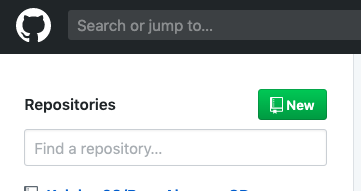
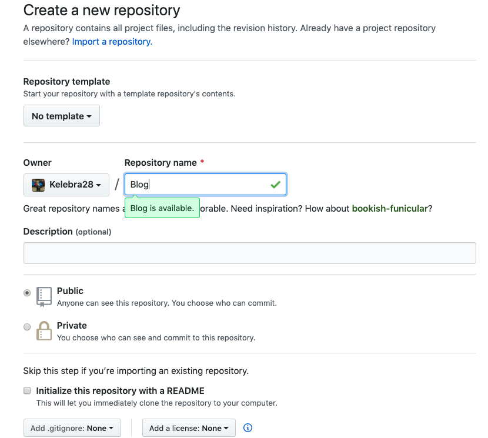
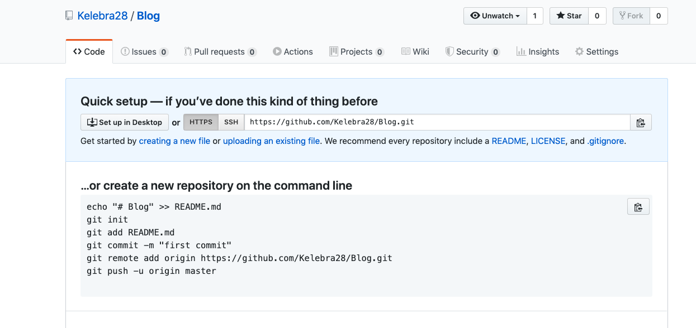
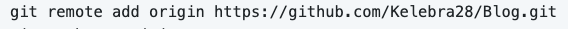
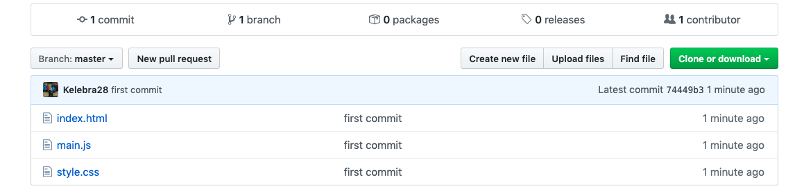

Para que nosotros podamos subir un **proyecto o carpeta** a **Github** desde nuestra terminal, tenemos que seguir lo siguientes pasos para hacerlo de una manera adecuada y sencilla.
Algo importante de aclarar es git GIT no es lo mismo de GitHub, Git el es lenguaje de control de versiones y GitHub es la plataforma en el cual vamos a subir nuestro código.

## 1. Configurar git en nuestra terminal.

Si tenemos **windows** como sistema operativo, vamos a descargar [Git Bash](https://gitforwindows.org/), si tenemos mac o linux, solo basta con abrir nuestra terminal.(Git Bash nos permite utilizar el lenguaje **GIT** en windows).

<p align="center">
  
</p>


Una vez que la tengamos abierta, tenemos que configurar nuestra identidad de git, esto para que al momento de hacer commits  tengan el registro de quien está haciendo los cambios al código.
Para llevar a cabo esto, vamos a escribir el siguiente comando:

Este comando configura el nombre de usuario de manera global, es decir en toda la computadora, es importante sustituir *"user-name"* por tu nombre de usuario.

```git

git config --global user.name "user-name"

```

Es siguiente comando va configurar de manera global nuestro correo, de nuevo remplazamos *"user@example.com"* por nuestro correo.

```git

git config --global user.email user@example.com

```

Si queremos comprobar que se hicieron las configuraciones de la manera correcta podemos usar el siguiente comando.

```git

git config --list

```

Esto nos mostrara las configuraciones de git y en ellas nos dira nuesto *user.name* y *user.email*.

```
user.name=user-name
user.email=user@example.com

```

## 2. Configurar nuestro ***repositorio*** en ***GitHub***

Vamos a ir a plataforma de [GitHub](https://github.com/). (Se necesita tener una cuenta, si no la tiene creela).

Podemos observar un **botón** verde del lado superior izquierdo que dice **“New”**, le vamos a dar click y nos llevará a un patalla.

<p align="center">
  
</p>

En esta pantalla, tenemos diferentes opciones, lo único que vamos a hacer un asignar un nombre a este repositorio, lo demás no lo vamos a tocar, y le daremos el botón verde que dice **“Create new repository”**.


<p align="center">
  
</p>

Una vez que se cree el repositorio nos mostrar la siguiente pantalla  con las siguientes instrucciones.

<p align="center">
  
</p>


Vamos a regresar a **nuestra terminal** y vamos a ir a la **carpeta que queremos subir**, y podremos el primer comando, el cual hará que se cree una carpeta oculta llamada **.git** y va a inicializar nuestro repositorio.

```git

git init

```

El comando **git status** es para saber el status de nuestra carpeta y saber en qué parte del proceso esta.

```git

git status

```


Hay **3 diferentes estados** cuando utilizamos git.

* 1. Working directory: Es cuando estamos trabajando en el código y no hay ningún cambio guardado.

* 2. Staging area: Un área segura donde hemos guardado cambios, estamos seguros de nuestros cambios

* 3. Repository : Una vez que estemos seguro de nuestros cambios, tenemos que confirmarlos para poder subir nuestro código. 


<p align="center">
  
</p>

Para pasar nuestro código a staging area podemos el siguiente comando **git add .** y después ponemos de nuevo *git status* para saber en que estado esta.(El **.** guarda todos nuestros archivos).

```git

git add .

git status

```


El siguiente paso es confirmar mis cambios para eso el comando **git commit -m "mensaje"** para pasarle un mensaje  de confirmación.

```git

git commit -m "first commit"

```


Ya que tenemos nuestros cambios confirmandos, vamos a **copiar el comando** que nos aparece en nuestra pantalla de Github, esto hace la unión de mi carpeta local a el repositorio de GitHub.

<p align="center">
  
</p>


```git

git remote add origin "url"

```

Y por último, lo siguiente solo es subir los archivos, usamos el comando **git push -u origin master**.

```git

git push -u origin master

```

Este comando subir nuestro código, **el -u es para autentificarse**, **origin hace referencia al link a donde se va a subir**(Nuestro repositorio) y **master es la nueva rama que se va a crear que es la principal.** 

Les va a pedir que metan su usuario y contraseña , una vez que terminen, recarguen la página de GitHub y listo! 

## Su Codigo ya esta arriba!.


<p align="center">
  
</p>

